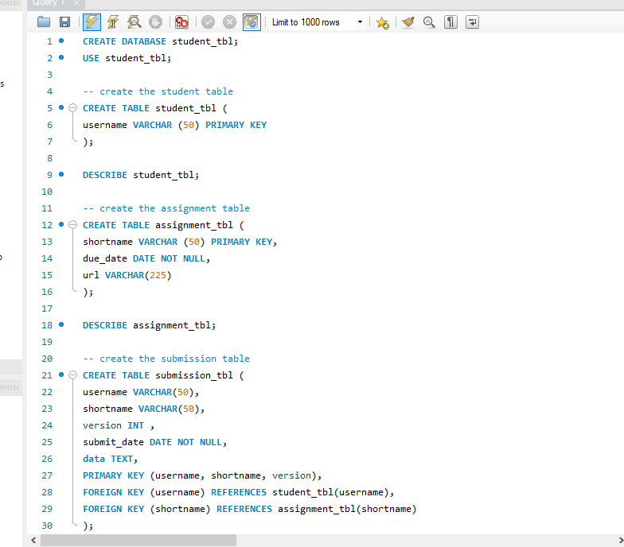
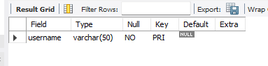
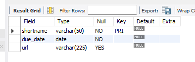
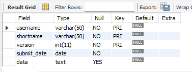
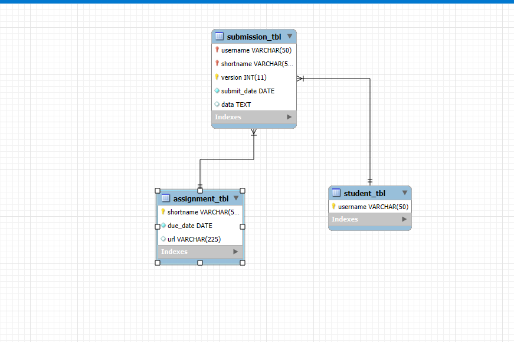

# Finals Task 2 – Converting ER Model to Relational Tables
‎
‎In this task, you’ll create a MySQL database from an ER model that tracks student assignment submissions. You’ll make tables for students, assignments, and submissions. Each table will have keys to keep everything connected properly and make sure the data stays accurate.
‎

## ‎Step 1: Create the Students Table

* ‎Make a table to store student info.  
* ‎Each student should have a unique username (max 50 characters).  
* Set the username as the main key so it can’t be repeated.
‎

## ‎Step 2: Create the Assignments Table
* Make a table for assignment details.  
* ‎Use a short name (shortname) as a unique ID for each assignment.  
* ‎Include a due date that can’t be left blank.  
* ‎Add a URL field for links related to the assignment, but it’s okay if it’s empty.

‎
‎
## Step 3: Create the Submissions Table  
* ‎Make a table to track which student submitted which assignment.  
* This table should link a student’s username with an assignment’s shortname.
* Allow multiple submissions for the same assignment by the same student.  
* Add a submission date to track when it was turned in.  
* Add a field to hold the content of the submission.  
* Use foreign keys to link this table to the Students and Assignments tables to keep everything connected properly.

### MySQL COMMANDS

## Outputs
### Table Structure Screenshots

Student Table:

Assignment Table:

Submission Table:

### ER Diagram Representation

### SQL Copy of the Database
 [Transforming ER Model to Ralational Tables](https://github.com/IrishBalingit/README.md/blob/main/Final%20Task%202/Transforming%20ER%20Model%20to%20Ralational%20Tables)

‎
