# Finals Task 4: Using SELECT Statements

‎This task involved using one database with two tables which is the EmployeeSalaries and EmployeeData. while using several SELECT statements to get and work with employee details.
‎
### ‎Instructions
1. ‎Create a database named payroll, use payroll
2. ‎Copy and paste the initial query then perform the SELECT statements required for each problem.
‎
### ‎Problem 1:
Consider a table named EmployeeSalaries that stores information about the salaries of employees. The table has the following fields:

* employee_id INT AUTO_INCREMENT PRIMARY KEY,
* employee_name VARCHAR(100),
* department VARCHAR(50),
* salary DECIMAL(10,2),
* hire_date DATE
* );

* INSERT INTO EmployeeSalaries (employee_name, department, salary, hire_date) VALUES
* ('John Smith', 'Sales', 75000.00, '2017-05-15'),
* ('Jane Doe', 'Marketing', 85000.00, '2018-03-20')
* ('Michael Johnson', 'Sales', 90000.00, '2016-08-10'),
* ('Emily Brown', 'HR', 65000.00, '2019-01-05'),
* ('David Wilson', 'Marketing', 80000.00, '2017-10-25'),
* ('Jennifer Lee', 'IT', 95000.00, '2015-06-30'),
* ('Christopher Davis', 'Sales', 70000.00, '2020-02-12'),
* ('Jessica Martinez', 'IT', 105000.00, '2014-09-18'),
* ('Andrew Taylor', 'Marketing', 75000.00, '2018-07-15')
* ('Elizabeth Anderson', 'HR', 60000.00, '2020-04-01'),
* ('Daniel Thomas', 'IT', 98000.00, '2017-12-10'),
* ('Sarah White', 'Sales', 82000.00, '2019-08-05'),
* ('Kevin Garcia', 'HR', 70000.00, '2016-03-08')
* ('Laura Martinez', 'Marketing', 88000.00, '2017-04-22'),
* ('Robert Lopez', 'IT', 93000.00, '2018-11-15'),
* ('Amanda Harris', 'Sales', 78000.00, '2018-09-30');

Perform the following SELECT statements on the table:
‎
1. ‎Retrieve the employee_name and salary of employees and arrange from the highest salary to the lowest.
‎
2. ‎Retrieve the department names along with the average salary for each department.

## MySQL Command
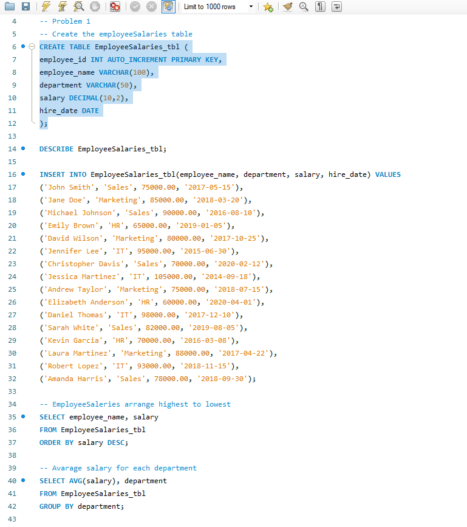

## ‎Outputs:
EmployeeSalaries Table

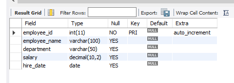

Employeesalaries (highest to lowest)

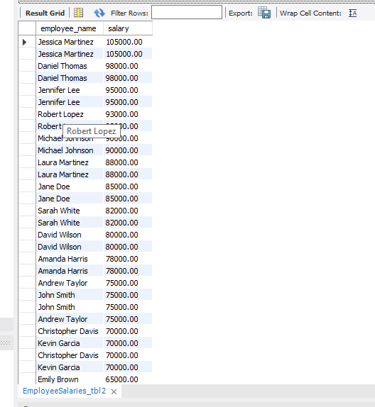

Avg salary each department

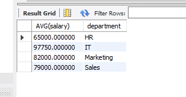

Total salary each department

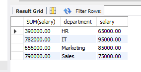

### Problem 2. Consider a table named EmployeeData that stores information about employees in a company. The table has the following fields:
1. Create a database named employeeDB, use employeeDB
2. Copy and paste the initial query below then perform the SELECT statements required for each problems.

* employee_id INT AUTO INCREMENT PRIMARY KEY
* full_name VARCHAR(100)
* department - VARCHAR(50)
* salary - DECIMAL(10,2)
* hire_date - DATE
* manager_id INT

Perform the following SELECT statements on the table:
1. Retrieve the employees along with their full names and salaries from highest paying. employee to the lowest.
2. Retrieve the average salary from EmployeeData table, where the average salary exceeds $70,000.
3. Retrieve the full names of employees who earn a salary greater than $100,000.
4. Retrieve the number of employees from the EmployeeData table.
  
* CREATE TABLE EmployeeData (
* employee_id INT AUTO_INCREMENT PRIMARY KEY, full_name VARCHAR(100),
* department VARCHAR(50), salary DECIMAL(10,2),
* hire date DATE, manager_id INT ; )
* INSERT INTO EmployeeData (full_name, department, salary, hire_date, manager_id) VALUES
* ('John Smith', 'Sales', 75000.00, '2017-05-15', NULL),
* ('Jane Doe', 'Marketing', 85000.00, '2018-03-20', NULL),
* ('Michael Johnson', 'Sales', 90000.00, '2016-08-10', 1),
* ('Emily Brown', 'HR', 65000.00, '2019-01-05', NULL),
* ('David Wilson', 'Marketing', 80000.00, '2017-10-25', 2), ('Jennifer Lee', 'IT', 95000.00, '2015-06-30', NULL),
* ('Christopher Davis', 'Sales', 70000.00, '2020-02-12', 3), ('Jessica Martinez', 'IT', 105000.00, '2014-09-18', 6),
* ('Andrew Taylor', 'Marketing', 75000.00, '2018-07-15', 2),
* ('Elizabeth Anderson', 'HR', 60000.00, '2020-04-01', 4), ('Daniel Thomas', 'IT', 98000.00, '2017-12-10', 6),
* ('Sarah White', 'Sales', 82000.00, '2019-08-05', 1),
* ('Kevin Garcia', 'HR', 70000.00, '2016-03-08', 5),
* ('Laura Martinez', 'Marketing', 188000.00, '2017-04-22', 4),
* ('Robert Lopez', 'IT', 193000.00, '2018-11-15', 9),
* ('Amanda Harris', 'Sales', 128000.00, '2018-09-30', 1);
* '2023-06-15', 'GeoSensor');

## MySQL Command
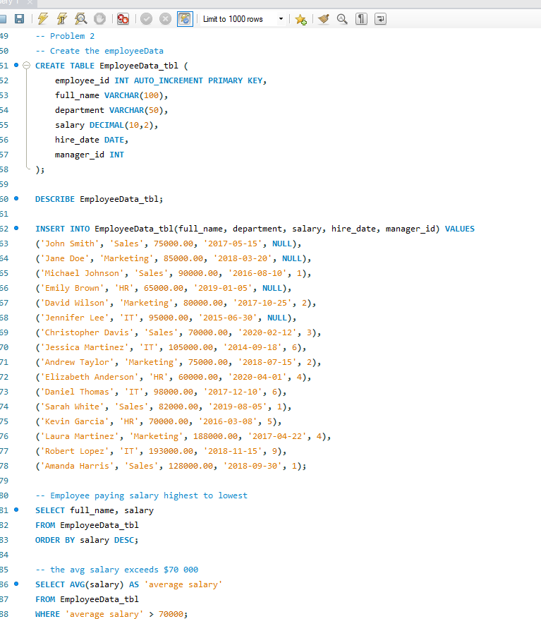

## Outputs:
EmployeeDate Table

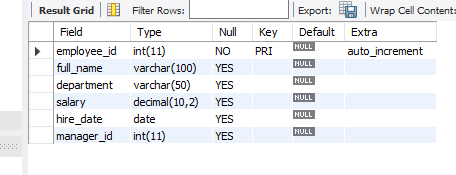

Employee paying salary (highest to lowest)

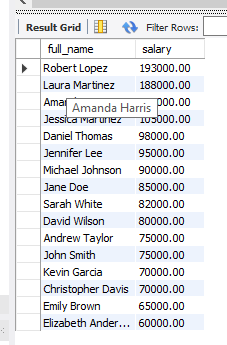

Avg salary exceeds $70,000

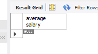

Employee earning salary greater  to $100,000

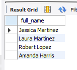

Number of Employee

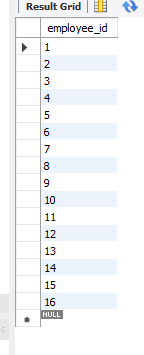

### SQL Copy of the Datebase
[Using SELECT Statements](https://github.com/IrishBalingit/README.md/blob/main/Final%20Task%204/Using%20SELECT%20Statement.sql)
