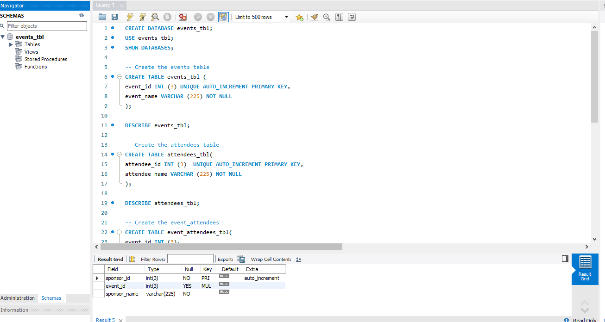
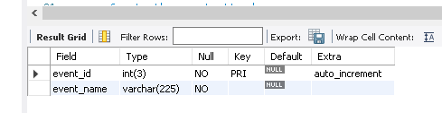
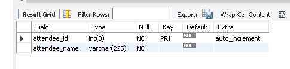
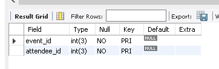
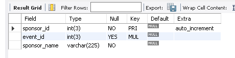
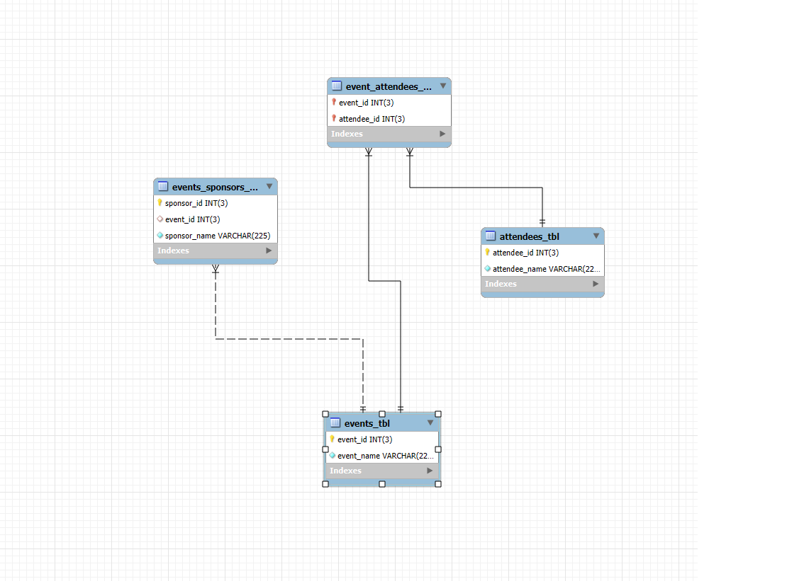

# Finals Lab Task 1 - MySQL Basics (Event Management)
This task involves designing and implementing a MySQL database for an event management system. The database consists of four tables: Events, Attendees, Event Attendees, and Event Sponsors.

## Step 1: Database Design
* Events Table: Stores event details.
* Attendees Table: Tracks attendee information.
* Event_Attendees Table: Establishes many-to-many relationships between events and attendees.
* Event_Sponsors Table: Links sponsors to events and stores sponsorship details.

## Step 2: SQL Implementation
* Design the database structure: Create tables with primary keys, foreign keys, and composite keys to establish relationships between tables.
* Implement the database: Use MySQL statements to create the tables and define the relationships.
* Write SQL queries: Develop MySQL query statements to interact with the database.

## Step 3: MySQL Query Statements (SQL Commands)

## Step 4: Table Structure Screenshots
### Events Table:

### Attendees Table:

### Event_Attendees Table:

### Event_Sponsors Table:

## Step 5: ER Diagram Representation

## Step 6: SQL Copy of the Database

 [Event Management](https://github.com/IrishBalingit/README.md/blob/main/Final%20Task1/event%20management.sql)

