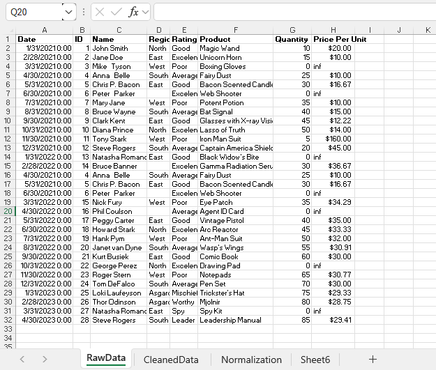
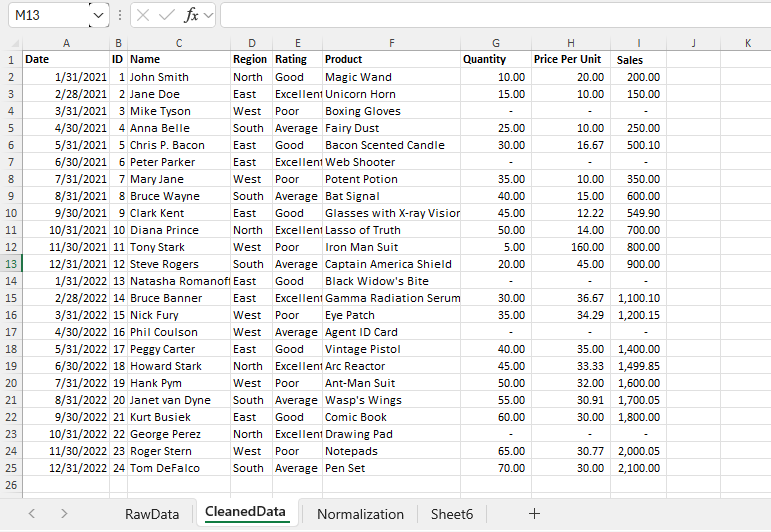

# Midterm Task 1 - Data Cleaning and Preparation using Excel
For this task we are given a flat data from (see rawfile) and we are task to perform Data Cleaning and Preparation
## STEP 1 Data Cleaning Process
- Load the raw file
- Fit Column and raw Width and Height
- TRIM extra spaces
- Remove duplicates
## STEP 2 Normalization
- Perform 1NF
- Perform Table split using 2NF
- Perform 3 NF
- Mapped the Normalized tables as a Physical Data Model
## STEP 3 Here's the screenshot of my output before I started data cleaning (See screenshot)

## STEP 4 Here's the screenshot of my output after I started data cleaning (See screenshot)

## Here's the Physical Data Model

